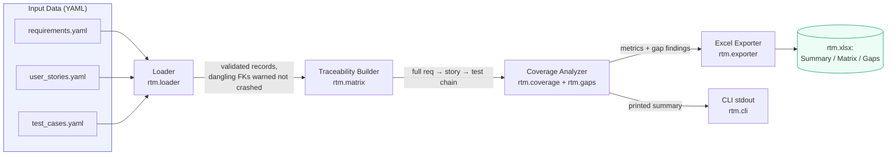

# Requirements Traceability Matrix (RTM) Tool

A working, tested command-line tool that builds a full **Requirements
Traceability Matrix** — requirements → user stories → test cases → UAT
execution status — from structured YAML input, computes coverage metrics,
and flags coverage gaps. It replaces the manual "RTM spreadsheet" a Business
Analyst typically maintains by hand with a reproducible, version-controlled,
one-command pipeline.

> **Disclaimer:** This is an independently written, representative portfolio
> project built entirely with synthetic data. It does not contain,
> reproduce, or reference any employer's proprietary code, data, or systems.

---

## 1. Business Problem

On most change-management or system-modernization initiatives, a Business
Analyst is responsible for proving — to auditors, to QA, to the steering
committee — that:

1. Every documented **requirement** is actually being built (has a linked
   user story / design item).
2. Every **user story** is actually being verified (has a linked test case).
3. Every **test case** has actually been **executed**, and the tool can show
   how many passed, failed, or are blocked.

In practice this traceability is usually maintained as a hand-updated Excel
workbook, cross-referenced manually against a requirements list, a backlog,
and a test-management tool export. That process is slow, error-prone, and
gets stale the moment any of the three source lists changes.

This tool treats the RTM as **data plus a build step**, the same way a BA
would want a report to work: point it at the current requirements, stories,
and test cases, and it regenerates an accurate matrix and a coverage-gap
report in seconds — with the same three findings an auditor would ask for:

- **Orphan requirements** — requirements nobody has scoped into a story yet.
- **Orphan stories** — stories with no test coverage at all.
- **Never-executed test cases** — tests that exist on paper but have not
  actually been run.

## 2. Architecture



**Data flow:** three independent input files are loaded and validated →
joined into one flat traceability chain (a left-outer-join at each hop, so
gaps are visible rather than dropped) → the same joined data feeds both the
coverage-metric calculator and the gap detector → results are exported to a
3-sheet Excel workbook and printed to the console.

## 3. Tech Stack

| Concern            | Choice                                   |
|---------------------|-------------------------------------------|
| Language            | Python 3.10+                              |
| Data input format   | YAML (via `PyYAML`)                       |
| Excel export        | `openpyxl` (no pandas dependency)         |
| CLI                 | `argparse`, `python -m rtm build ...`     |
| Testing             | `pytest`                                  |
| CI                  | GitHub Actions (matrix: Python 3.10–3.12) |
| Packaging / local run | `Dockerfile`, `pyproject.toml`          |

## 4. Repository Layout

```
requirements-traceability-tool/
├── rtm/                    # package
│   ├── __init__.py
│   ├── __main__.py         # enables `python -m rtm`
│   ├── cli.py               # argparse CLI: `build` subcommand
│   ├── loader.py             # YAML loading + validation + FK checks
│   ├── models.py             # Requirement / UserStory / TestCase / TraceRow
│   ├── matrix.py             # requirement -> story -> test join
│   ├── coverage.py           # coverage % calculations
│   ├── gaps.py                # orphan / never-executed detection
│   └── exporter.py            # Excel (openpyxl) export, 3 sheets
├── data/                    # committed synthetic sample data
│   ├── requirements.yaml    # 18 requirements
│   ├── user_stories.yaml    # 28 user stories
│   └── test_cases.yaml      # 45 test cases
├── tests/                   # pytest suite (32 tests)
├── .github/workflows/ci.yml
├── Dockerfile
├── requirements.txt
├── pyproject.toml
└── LICENSE
```

## 5. Installation

```bash
git clone <this-repo-url>
cd requirements-traceability-tool

python3 -m venv .venv
source .venv/bin/activate        # Windows: .venv\Scripts\activate

pip install -r requirements.txt
```

For running the test suite, also install `pytest` (or use
`requirements-dev.txt`, which includes it):

```bash
pip install -r requirements-dev.txt
```

## 6. Usage

Build the full RTM from the committed synthetic sample data:

```bash
python -m rtm build \
    --requirements data/requirements.yaml \
    --stories data/user_stories.yaml \
    --tests data/test_cases.yaml \
    --output out/rtm.xlsx
```

This loads and cross-validates the three input files, builds the full
traceability chain, computes coverage metrics, detects gaps, writes
`out/rtm.xlsx`, and prints a summary to the console.

Run `python -m rtm build --help` for all options, or `python -m rtm -v build
...` for debug-level logging (shows every loader validation decision).

### Running via Docker

```bash
docker build -t rtm-tool .
docker run --rm -v "$(pwd)/out:/app/out" rtm-tool
```

## 7. Sample Output (actual run, captured 2026-09-21)

Running the exact command in Section 6 against the committed `data/`
fixtures produces:

```
============================================================
REQUIREMENTS TRACEABILITY MATRIX - COVERAGE SUMMARY
============================================================
Total requirements : 18
Total user stories : 28
Total test cases   : 45
------------------------------------------------------------
% requirements with >=1 linked story : 77.8%
% stories with >=1 linked test case   : 85.7%
% test cases executed                 : 82.2%
% test cases passed                   : 55.6%
------------------------------------------------------------
COVERAGE GAPS
  Orphan requirements (no story)      : 4
    - REQ-015: Data Retention and Archival Policy [Medium]
    - REQ-016: Multi-Language Support [Low]
    - REQ-017: Mobile-Responsive Case Portal [Medium]
    - REQ-018: Integration with External Vendor Systems [Low]
  Orphan stories (no test case)       : 4
    - STORY-025 (req REQ-013): As the system, I calculate remaining SLA time for an open case
    - STORY-026 (req REQ-013): As a rep, I see a visual warning badge when a case is nearing SLA breach
    - STORY-027 (req REQ-014): As the system, I send a satisfaction survey link when a case is closed
    - STORY-028 (req REQ-014): As an analyst, I can view aggregated survey results by queue
  Never-executed test cases           : 8
    - TC-004 (story STORY-002): Search rejects malformed account number
    - TC-008 (story STORY-004): New technical-type case routes to technical queue
    - TC-012 (story STORY-006): Notification is suppressed for a reassigned case's prior owner
    - TC-016 (story STORY-008): Download of a deleted attachment returns a not-found message
    - TC-019 (story STORY-010): Non-finance user cannot view financial fields
    - TC-022 (story STORY-011): Audit entry captures the creating user's ID
    - TC-025 (story STORY-013): Customer can submit a valid address change request
    - TC-028 (story STORY-014): Invalid address format is flagged with a specific reason
============================================================

Excel workbook written to: out/rtm.xlsx
```

The exported `out/rtm.xlsx` has three sheets: **Summary** (the metrics
above), **Traceability Matrix** (one row per requirement → story → test
chain, with the Execution Status cell color-coded — green/passed,
red/failed, yellow/blocked, gray/not_run), and **Coverage Gaps** (the three
findings lists above, in exportable form).

A small excerpt of the **Traceability Matrix** sheet:

| Requirement ID | Requirement Title            | Story ID  | Test Case ID | Test Case Title                                | Execution Status |
|-----------------|-------------------------------|-----------|---------------|--------------------------------------------------|-------------------|
| REQ-001         | Customer Search and Lookup    | STORY-001 | TC-001        | Search returns exact full-name match             | passed            |
| REQ-001         | Customer Search and Lookup    | STORY-001 | TC-002        | Search returns no results for unknown name       | failed            |
| REQ-001         | Customer Search and Lookup    | STORY-002 | TC-003        | Search returns match for valid account number    | blocked           |
| REQ-001         | Customer Search and Lookup    | STORY-002 | TC-004        | Search rejects malformed account number          | not_run           |
| REQ-015         | Data Retention and Archival Policy | *(no linked user story)* | | *(no linked test case)* | no_test_case |

## 8. Data Model

Three related entities, each a flat list of records (YAML shown; a CSV
`DictReader` would feed the same loader functions unchanged):

```yaml
# requirements.yaml
requirements:
  - requirement_id: REQ-001
    title: Customer Search and Lookup
    description: Enable service representatives to search for a customer record...
    priority: High     # High | Medium | Low

# user_stories.yaml
user_stories:
  - story_id: STORY-001
    requirement_id: REQ-001   # foreign key -> requirements
    title: "As a rep, I can search for a customer by full name"

# test_cases.yaml
test_cases:
  - test_case_id: TC-001
    story_id: STORY-001       # foreign key -> user_stories
    title: Search returns exact full-name match
    execution_status: passed  # not_run | passed | failed | blocked
```

The committed `data/` sample set (18 requirements, 28 stories, 45 test
cases) has deliberate, intentional gaps baked in — 4 orphan requirements, 4
orphan stories, and 8 never-executed test cases — so the gap-detector has
real findings to report, exactly as shown in Section 7.

## 9. Error Handling & Logging

The loader is written to degrade gracefully rather than crash on the kind
of messy real-world input a BA actually receives:

- A record that fails to parse as a mapping, or is missing its required ID
  field, is **skipped with a `WARNING` log line** — it does not stop the run.
- A **dangling foreign key** (a story pointing at a `requirement_id` that
  doesn't exist, or a test case pointing at an unknown `story_id`) is
  **logged as a warning, not raised as an error** — the record is still
  loaded and will simply show up as unlinked in the matrix, which is itself
  useful diagnostic information.
- An unrecognized `priority` or `execution_status` value is coerced to a
  safe default (`Medium` / `not_run`) with a warning, rather than rejected.
- A genuinely missing or unparsable input *file* raises a clear
  `DataLoadError`, which the CLI catches and reports with a non-zero exit
  code (no stack trace dumped on the user).

Run with `-v` / `--verbose` for `DEBUG`-level logging of every validation
decision the loader makes.

## 10. Testing

```bash
pytest -v
```

32 tests cover: YAML loading and validation (happy path, malformed records,
duplicate IDs, dangling foreign keys, unknown enum values, missing files),
the traceability join logic (including orphan requirements/stories
producing rows with `None` children), coverage-percentage calculations
(including the zero-denominator edge case), gap detection, the Excel
exporter (sheet names, header row, gap findings present in the workbook),
and a full CLI end-to-end run against the committed sample data.

## 11. Limitations & Future Enhancements

- **Many-to-many is not modeled.** A test case that verifies more than one
  story, or a story satisfying more than one requirement, would need a
  schema change (currently each child record has exactly one parent FK).
- **No historical trend.** Each run is a point-in-time snapshot; there is no
  built-in tracking of how coverage % changed release over release (a
  natural next step: append each run's `Summary` sheet values, keyed by
  date, to a small history file).
- **CSV loader is not wired into the CLI yet**, though the loader functions
  are format-agnostic internally; adding a `--format csv` flag would be a
  small change.
- **No web UI.** This is intentionally a CLI-first tool; a thin Flask/Streamlit
  front end over the same `rtm` package would be a natural extension for
  non-technical stakeholders who want to browse the matrix interactively.
- **Single-file-per-entity assumption.** Large programs that split
  requirements across multiple files per workstream would need a loader
  change to merge several YAML files per entity type.

## 12. Security Considerations

- The tool makes **no external network calls** — everything is local file
  I/O (`PyYAML` read, `openpyxl` write). There is no telemetry, no API key,
  and no credential of any kind involved anywhere in this codebase.
- All data shipped in this repository (`data/`) is **entirely synthetic and
  fictional** — no real requirements, customer data, or proprietary business
  logic from any employer or client.
- **If this tool were adapted to hold real requirements/test data from a
  regulated industry** (financial services, insurance, healthcare, etc.),
  the input files and generated workbook would need to be treated as
  sensitive: stored in an access-controlled repository or file share (not a
  public one), excluded from any public CI artifact upload, and handled
  under whatever data-classification policy governs requirements and test
  documentation at that organization. This portfolio version deliberately
  keeps CI artifacts (the built `.xlsx`) attached only to the (private, by
  default) GitHub Actions run for that reason.

## 13. License

MIT — see [LICENSE](LICENSE).
